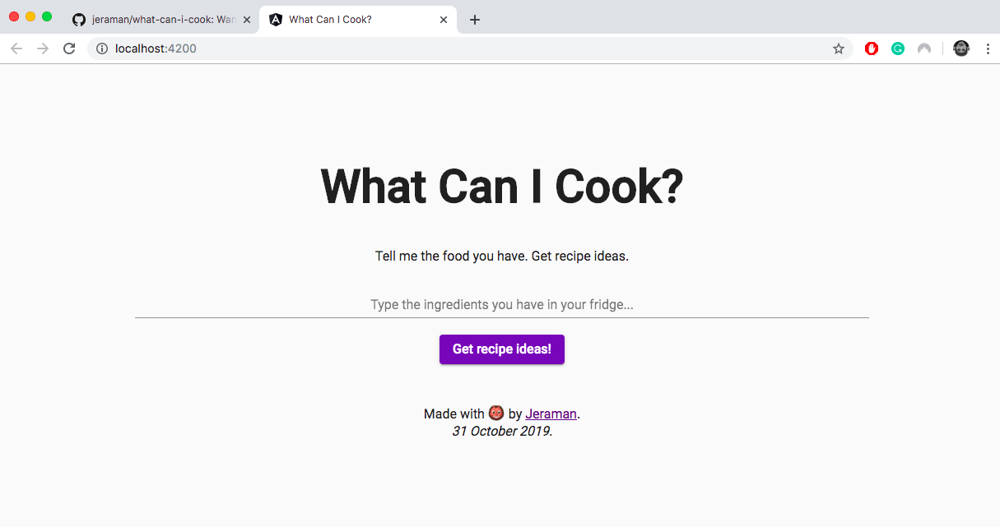

# What Can I Cook?
[](http://opensource.org/licenses/MIT)

[](https://jeraman.info/what-can-i-cook)


Want to finish the food in your fridge before expiration?

No worries, this app will help you.

Tell it the food you have. Get recipe ideas.

You can try it out at:
> [https://jeraman.info/what-can-i-cook](https://jeraman.info/what-can-i-cook)

## Technology used
- [Angular CLI](https://github.com/angular/angular-cli) version 8.3.4;
- [Food2Fork API](https://www.food2fork.com/about/api);
- [Angular Materials](https://material.angular.io/) version 8.2.3.

## Note
If you would like to run this project locally, you will need a [Food2Ford API key](https://www.food2fork.com/about/api). You can get one limited key for free at their website. The key should be placed inside the file `./src/assets/js/keyConfig.json`. Its content should be as follows:
```json
{
  "key": "MY_API_KEY"
}

```
