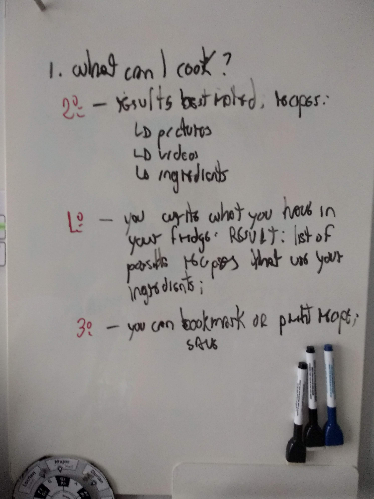

# Documentation
I wrote a few words about the:
1. [First ideas:](#first-idea) Presenting the first rough idea;
2. [Backend](#backend): Presenting the research that led me to the Food2Fork API;
3. [Frontend](#frontend) Presenting the research that led me to Angular Materials;
4. [Final remarks](#final-remarks) where I comment on running the project in your own machine.

## First idea
I wanted to build a simple project to improve my Angular skills. This is the first idea that came to my mind:



Before coding, I sketched out how the system should ideally look like. This is the result:


## Backend
One critical question is where to find the recipes database. Some possible options are:

- [Allrecipes REST API](https://apps.allrecipes.com/): While this seems hosted inside AllRecipes servers, I wasn't able to find further info on how to use this;
- [API BigOven](https://api.bigoven.com/): A paid REST API. Won't work for me;
- [python-allrecipes](https://api.bigoven.com/): A webcrawler-based solution;
- [Food2Fork](https://www.food2fork.com/about/api): A REST API that is free for educational purposes, gathering recipes from several different sources. Perfect! Free queries are limited to 50/day.

### Food2Fork
After signing up for a free account, I started experimenting with the API. The API is very straightforward. For example, this is how you query recipes based on chicken and tomatoes:
```
https://www.food2fork.com/api/search?key=YOUR_API_KEY&q=chicken%20tomatoes&page=2&sort=r
```
The JSON result is something like (only two results are presented):
```JSON
{
  "count": 2,
  "recipes": [
    {
      "publisher": "BBC Food",
      "f2f_url": "http://food2fork.com/view/8c0314",
      "title": "Chicken and cashew nut stir-fry",
      "source_url": "http://www.bbc.co.uk/food/recipes/chickenandcashewnuts_89299",
      "recipe_id": "8c0314",
      "image_url": "http://static.food2fork.com/chickenandcashewnuts_89299_16x9986b.jpg",
      "social_rank": 95.91061636245128,
      "publisher_url": "http://www.bbc.co.uk/food"
    },
    {
      "publisher": "Jamie Oliver",
      "f2f_url": "http://food2fork.com/view/0beb06",
      "title": "Roasted chicken breast with pancetta, leeks & thyme",
      "source_url": "http://www.jamieoliver.com/recipes/chicken-recipes/roasted-chicken-breast-with-pancetta-leeks-and-thyme",
      "recipe_id": "0beb06",
      "image_url": "http://static.food2fork.com/466_1_1349094314_lrg2129.jpg",
      "social_rank": 94.88568903341375,
      "publisher_url": "http://www.jamieoliver.com"
    }
  ]
}
```

Each query returns 30 results maximum. You also have two parameters to play around:
- `page=1`: Specify the results page (again, only 30 results are displayed per page);
- `sort=r`: Sort results by ratings.

Alternatively, one might want to get more details on  specific recipes (e.g., what ingredients are necessary for this particular recipe). In this case, you can do the following query:
```
https://www.food2fork.com/api/get?key=YOUR_API_KEY&rId=35382
```

Which results in a JSON object like:
```JSON
{
  "recipe": {
    "publisher": "Closet Cooking",
    "f2f_url": "http://food2fork.com/view/35382",
    "ingredients": [
      "2 jalapeno peppers, cut in half lengthwise and seeded",
      "2 slices sour dough bread",
      "1 tablespoon butter, room temperature",
      "2 tablespoons cream cheese, room temperature",
      "1/2 cup jack and cheddar cheese, shredded",
      "1 tablespoon tortilla chips, crumbled\n"
    ],
    "source_url": "http://www.closetcooking.com/2011/04/jalapeno-popper-grilled-cheese-sandwich.html",
    "recipe_id": "35382",
    "image_url": "http://static.food2fork.com/Jalapeno2BPopper2BGrilled2BCheese2BSandwich2B12B500fd186186.jpg",
    "social_rank": 100,
    "publisher_url": "http://closetcooking.com",
    "title": "Jalapeno Popper Grilled Cheese Sandwich"
  }
}
```

And that's it! I'm good to go!

## Frontend
Time has come to make the app look 'fancier'. A traditional approach for improving 'look and feel' is pure HTML and CSS. However, there are today many well-known frameworks to help us in this task. Examples are:

- [Bootstrap:](https://getbootstrap.com/) One of the most popular solutions out there. Bootstraps is open-source, supports several [different interface components](https://getbootstrap.com/docs/4.0/components), and is first designed to be lightweight (for mobiles). One nice introductory tutorial can be found [here](https://getbootstrap.com/docs/4.0/components). Some people have even created a [library](https://ng-bootstrap.github.io/#/home) to improve Bootstrap integration with Angular.

- [Angular Materials:](https://material.angular.io/) A fancy name for sure! While not as popular as Bootstrap, it has the benefit of having a nice integration with Angular. Designed after [Google's Material Design](https://en.wikipedia.org/wiki/Material_Design).

- [DIY, of course!](https://www.taniarascia.com/you-dont-need-a-framework/) That will help you to improve your knowledge in the fundamentals of responsive design with HTML and CSS!

Alternatives to these solutions can be found on [this post](https://hackr.io/blog/top-bootstrap-alternatives).

### Angular Materials
I decided to give Angular Materials a try. I just loved [Google's Material Design](https://en.wikipedia.org/wiki/Material_Design) proposal: It's a bit abstract, but seems less web-specific and potentially extensible to other contexts. Moreover, Materials' components such as [Cards](https://material.angular.io/components/card/examples) and [Chips](https://material.angular.io/components/chips/overview) seems pretty suited to this project.

My experience with Materials was good, but far from ideal.

At first, I was able to setup and get things going easily using [this short guide](https://material.angular.io/guide/getting-started). The library seems easy and straightforward. However, I started struggling when I tried to use [Grid Lists](https://material.angular.io/components/grid-list/overview). I just wasn't able to get the layouts I wanted. Some devs argue that Materials provide poor support to [flex layout grids if compared to Bootstrap](https://www.amadousall.com/the-good-parts-of-bootstrap-4-you-are-missing-in-your-angular-material-projects/) (that is, supporting layout grids that dynamically adapts to the size of the screen). If you want to deal with layout grids properly, you need another library called [Flex Layout](https://github.com/angular/flex-layout) (also developed by the Angular team). Disappointing! In the end, I implemented my layout grid using pure CSS.

I also had the impression that Bootstrap supports many more components (full list [here](https://getbootstrap.com/docs/4.3/components/alerts/)) than [Materials](https://material.angular.io/components/categories). One example I would have used is the [star rating component](https://ng-bootstrap.github.io/#/components/rating/examples). Again, I had to implement my star rating from scratch with pure HTML & CSS. Furthermore, I also had the impression that Materials' documentation isn't as widespread as Bootstraps'.

This is how my implementation looked like:

[](https://jeraman.info/what-can-i-cook)

*Summary*: Materials is nice, but I will definitely give Bootstrap a try in my next project.

## Final remarks
That is it! This was a fun project to build!

By the way, if you would like to clone the project and run it locally, you will need a [Food2Ford API key](https://www.food2fork.com/about/api). You can get one limited key for free at their website. The key should be placed inside the file `./src/assets/js/keyConfig.json`. Its content should be as follows:
```json
{
  "key": "MY_API_KEY"
}
```
