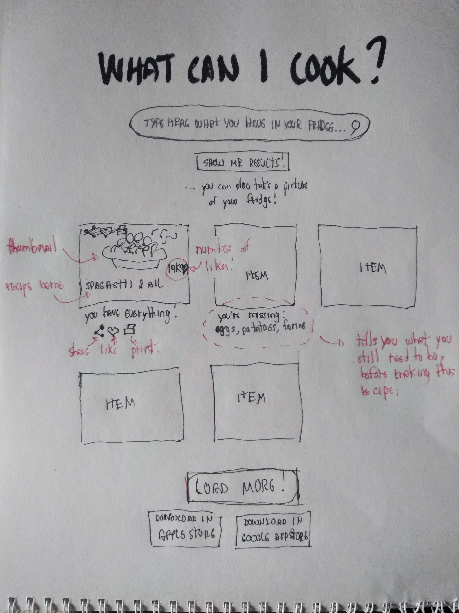

# Frontend
Time has come to make the app look 'fancier'. A traditional approach for improving 'look and feel' is pure HTML and CSS. However, there are today many well-known frameworks to help us in this task. Examples are:

- [Bootstrap:](https://getbootstrap.com/) One of the most popular solutions out there. Bootstraps is open-source, supports several [different interface components](https://getbootstrap.com/docs/4.0/components), and is first designed to be lightweight (for mobiles). One nice introductory tutorial can be found [here](https://getbootstrap.com/docs/4.0/components). Some people have even created a [library](https://ng-bootstrap.github.io/#/home) to improve Bootstrap integration with Angular.

- [Angular Materials:](https://material.angular.io/) A fancy name for sure! While not as popular as Bootstrap, it has the benefit of having a nice integration with Angular. Designed after [Google's Material Design](https://en.wikipedia.org/wiki/Material_Design).

- [DIY, of course!](https://www.taniarascia.com/you-dont-need-a-framework/) That will help you to improve your knowledge in the fundamentals of responsive design with HTML and CSS!

Alternatives to these solutions can be found on [this post](https://hackr.io/blog/top-bootstrap-alternatives).

## First sketches
Before coding, I sketched out how the interface should ideally look like. This is my first sketch:

## Angular Materials
To implement this sketch, I decided to give Angular Materials a try. I just loved [Google's Material Design](https://en.wikipedia.org/wiki/Material_Design) proposal: It's a bit abstract, but seems less web-specific and potentially extensible to other contexts. Moreover, Materials' components such as [Cards](https://material.angular.io/components/card/examples) and [Chips](https://material.angular.io/components/chips/overview) seems pretty suited to this project.

### My Experience

My experience was good, but far from ideal.

At first, I was able to setup and get things going easily using [this short guide](https://material.angular.io/guide/getting-started). The library seems easy and straightforward. However, I started struggling when I tried to use [Grid Lists](https://material.angular.io/components/grid-list/overview). I just wasn't able to get the layouts I wanted. Some devs argue that Materials provide poor support to [flex layout grids if compared to Bootstrap](https://www.amadousall.com/the-good-parts-of-bootstrap-4-you-are-missing-in-your-angular-material-projects/) (that is, supporting layout grids that dynamically adapts to the size of the screen). If you want to deal with layout grids properly, you need another library called [Flex Layout](https://github.com/angular/flex-layout) (also developed by the Angular team). Disappointing! In the end, I implemented my layout grid using pure CSS.

I also had the impression that Bootstrap supports many more components (full list [here](https://getbootstrap.com/docs/4.3/components/alerts/)) than [Materials](https://material.angular.io/components/categories). One example I would have used is the [star rating component](https://ng-bootstrap.github.io/#/components/rating/examples). Again, I had to implement my star rating from scratch with pure HTML & CSS. Furthermore, I also had the impression that Materials' documentation isn't as widespread as Bootstraps'.

This is how my implementation looked like:

*Summary*: Materials is nice, but I will definitely give Bootstrap a try in my next project.
